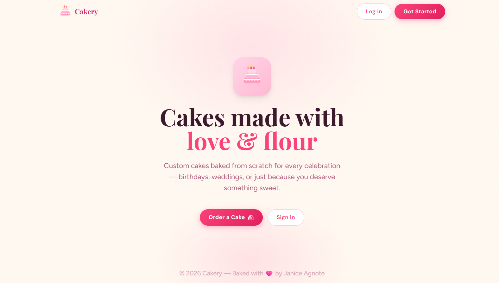
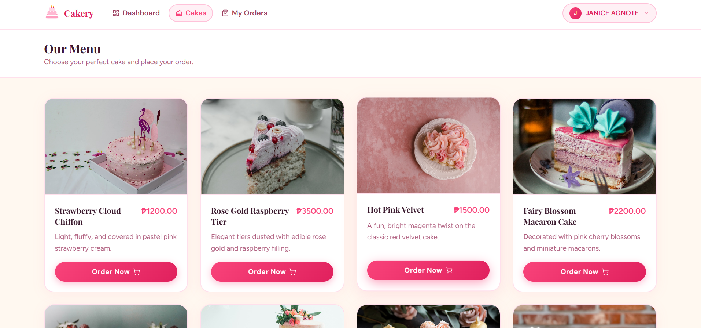
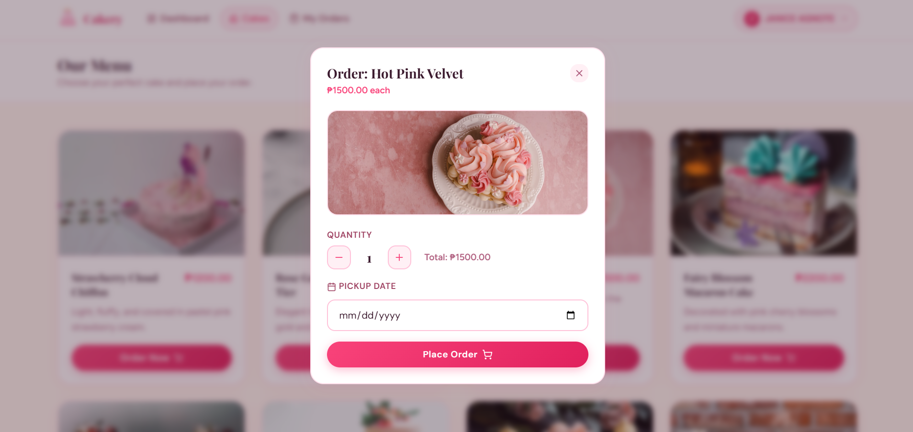
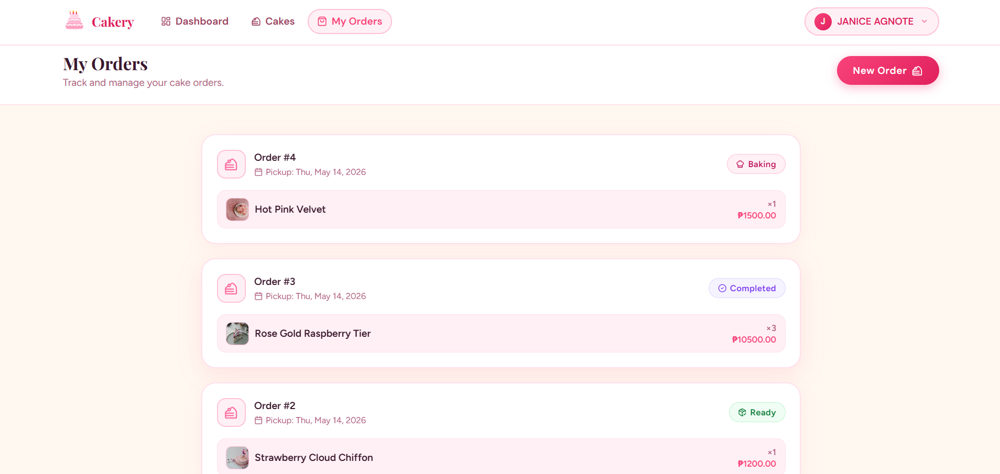
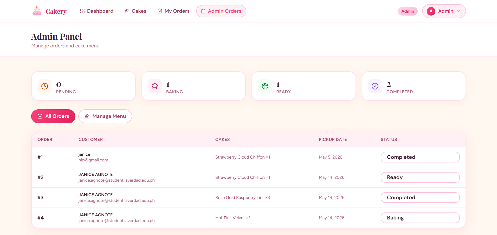
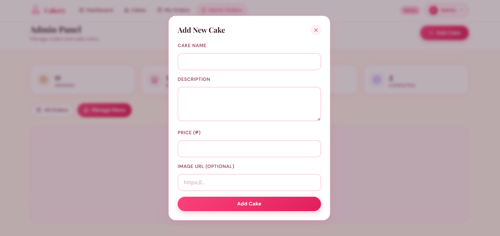

# Cakery — Custom Cake Ordering App

---

## About This Project

Cakery is a custom cake ordering web application built from scratch using Laravel, Inertia.js, and React. It was developed as the final project for WAD 2, demonstrating proper implementation of core Laravel concepts including authentication, middleware, authorization, eloquent relationships, and full CRUD operations.

The system has two types of users — customers and admins. Customers can browse the cake menu, place orders, and manage their profile. Admins can manage the cake menu and update order statuses.

---

## Demo Video

---

## Screenshots

### Home Page
The landing page with a welcome message and buttons to log in or register.

### Cake Menu
Browse all available cakes with their name, price, and photo. Admins can add, edit, or delete cakes from here.

### Order Modal
Customers fill in the quantity and pickup date to place an order for a selected cake.

### My Orders
Shows all orders placed by the logged-in customer along with their current status. Pending orders can be cancelled.

### Admin — All Orders
Admin view of every customer order sorted by pickup date. Admins can update each order's status from here.

### Admin — Add Cake
Admin-only modal for adding a new cake to the menu with a name, description, price, and image URL.

---

## Tech Stack

- **Backend:** Laravel 
- **Frontend:** React + Inertia.js
- **Styling:** Tailwind CSS
- **Authentication:** Laravel Breeze
- **Database:** SQLite
- **Cake Images (Seeder):** Unsplash

---

## Implemented Features

### 1. CRUD Operations

- **Cakes** — Admins can create, read, update, and delete cakes from the menu.
- **Orders** — Customers can place and cancel their own orders. Admins can read all orders and update their status.
- **Profile** — Customers can update their name, email, phone number, delivery address, and delete their account.

### 2. Authentication

Built with Laravel Breeze. Users must be logged in to access the cake menu, place orders, and view their profile. The system uses session-based authentication with password hashing.

### 3. Middleware

**`IsAdmin`** — A custom middleware applied to all `/admin/*` routes. It checks whether the authenticated user has the `admin` role before allowing access. Any non-admin user attempting to reach an admin route is blocked.

### 4. Authorization (Gates, Policies, Service Providers)

**Gates** are defined in `AppServiceProvider` and check if the authenticated user has the `admin` role:

- `manage-inventory` — Controls who can add, edit, or delete cakes. Used inside `CakeController`.
- `update-orders` — Controls who can view all orders and change their status. Used inside `AdminOrderController`.

**`OrderPolicy`** — Handles what a customer is allowed to do with their own orders:

- A customer can only **view** an order that belongs to them.
- A customer can only **cancel** an order if it belongs to them and the status is still `pending`. Once baking has started, cancellation is no longer allowed.

### 5. Eloquent Relationships

- A **User** has one **Profile** (stores phone number and delivery address).
- A **User** has many **Orders**.
- An **Order** belongs to a **User**.
- An **Order** belongs to many **Cakes** through a pivot table that also stores the **quantity**.
- A **Cake** belongs to many **Orders** through the same pivot table.

---

### Default Accounts

| Role | Email | Password |
|---|---|---|
| Admin | admin@cakery.com | password |
| Customer | customer@cakery.com | password |

---

Built with love by **Janice Agnote**
